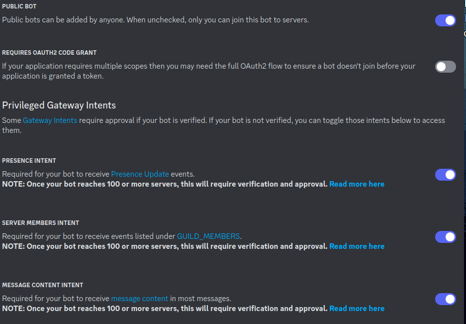
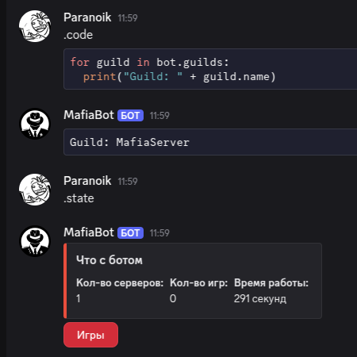

<div align=center>

# 📚 Документация Mafia Bot для Discord

[](https://www.python.org/downloads/)
[](https://discordpy.readthedocs.io/)
[](LICENSE)

> Полное руководство по установке, настройке и управлению ботом для игры в Мафию

 <!-- Добавьте логотип -->

</div>

## 🛠 Установка и настройка

### ⚙️ Требования
- Python 3.12
- Discord сервер с правами администратора
- Доступ к [порталу разработчиков Discord](https://discord.com/developers/applications)

### 🔐 Настройка интентов
1. Перейдите на [портал разработчиков Discord](https://discord.com/developers/applications)
2. Выберите ваше приложение
3. В разделе "Bot" включите:
   - `PRESENCE INTENT`
   - `SERVER MEMBERS INTENT`
   - `MESSAGE CONTENT INTENT`



### 🚀 Установка бота
```bash
# Клонирование репозитория
git clone https://github.com/paranoik1/MafiaBot.git
cd MafiaBot

# Установка зависимостей
pip install -r requirements.txt

# Создание конфигурационного файла
touch .env
nano .env  # Редактируем файл конфигурации
```

### 🔧 Конфигурация (.env)
```ini
BOT_TOKEN=your_bot_token_here
OWNER_ID=your_discord_id
YOOMONEY_TOKEN=your_yoomoney_token
YOOMONEY_RECEIVER=your_yoomoney_wallet
```

### ▶️ Запуск бота
```bash
python main.py
```

## 👨‍💻 Команды для разработчика

Требуют прав владельца бота (`OWNER_ID` из .env)

### 📊 Информация о состоянии (`.state`)
Показывает ключевую статистику бота:

```bash
Серверов: 42
Активных игр: 7
Аптайм: 2д 5ч 13м
```

### 💻 Выполнение кода (`.code`)
Позволяет выполнять Python код прямо в чате.

**Форматы:**
```python
.code print("Hello World")  # Однострочный код

.code
```python
for i in range(3):
    print(f"Многострочный код {i}")
```  # Многострочный код
```

**Безопасность:**
⚠️ Эта команда может выполнять ЛЮБОЙ Python код. Используйте с осторожностью!


### 📸 Скриншот



## 🛡 Меры безопасности
1. Никому не передавайте ваш `BOT_TOKEN`
2. Ограничьте доступ к командам разработчика
3. Регулярно обновляйте зависимости
4. Используйте виртуальное окружение

## ❓ Поддержка
Если у вас возникли проблемы:
1. Создайте issue в [репозитории](https://github.com/paranoik1/MafiaBot/issues)

---

[⬆ Наверх](#) | [🏠 Главная страница](README.md)
