<div align=center>

# 🎭 Mafia Bot for Discord

[](https://github.com/your-repo/LICENSE)


> Полнофункциональный бот для игры в Мафию с автоматизированным управлением, поддержкой множества ролей и премиум-функциями

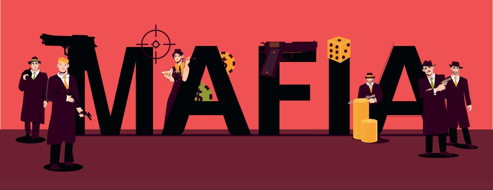

</div>

## ✨ Особенности

- 🎛️ Управление через интерактивное меню (уникальное среди ботов-мафий)
- 🎮 Полная автоматизация игры в Мафию
- 👥 Поддержка до 25 игроков (в премиум версии)
- 🏆 15+ уникальных ролей с различными способностями
- ⚙️ Гибкие настройки игры под ваш стиль
- 🌙 Автоматические ночные фазы и голосования
- 🔊 Голосовое сопровождение игры
- 💎 Другие премиум-функции для более захватывающего геймплея

## 🚀 Быстрый старт

### Установка

1. Клонируйте репозиторий:
```bash
git clone https://github.com/paranoik1/MafiaBot
cd MafiaBot
```

2. Установите зависимости:
```bash
pip install -r requirements.txt
```

3. Настройте конфигурацию:
```bash
nano .env
```

4. Запустите бота:
```bash
python main.py
```

[Полное руководство по установке](./DOCS.md)

## 🎮 Команды

### Основные
| Команда | Описание |
|---------|----------|
| `/help` | Получить помощь по боту |
| `/start-mafia` | Начать новую игру |
| `/stop-mafia` | Завершить текущую игру |

### Игровой процесс
| Команда | Описание |
|---------|----------|
| `/voting` | Начать голосование |
| `/night` | Перейти к ночной фазе |
| `/roles` | Просмотреть доступные роли |

### Премиум
| Команда | Описание |
|---------|----------|
| `/subscription` | Информация о подписке |
| `/buy` | Приобрести премиум |

## 💎 Премиум-функции

| Функция | Бесплатно | Премиум |
|---------|----------|---------|
| Макс. игроков | 12 | 25 |
| Доступные роли | Базовые (10) | Все (15) |
| Настройка игры | ❌ | ✅ |
| Игра без ведущего | ❌ | ✅ |
| Голосовая поддержка | ❌ | ✅ |

**Цены:**
- Личная подписка: **100₽/мес**
- Серверная подписка: **300₽/мес**

### 🔊 Голосовое сопровождение игры
Бот использует аудиофайлы, сгенерированные нейросетью с телеграмма: [@silero_voice_bot](https://t.me/silero_voice_bot)
#### 🎧 Аудиотека бота


| Файл | Описание | Прослушать |
|------|----------|------------|
| `ready.ogg` | Начало игры, знакомство с правилами | [▶️ Прослушать](audio/ready.ogg) |
| `day.ogg`   | Оповещение о начале дневной фазы | [▶️ Прослушать](audio/day.ogg) |
| `night.ogg` | Оповещение о ночной фазы | [▶️ Прослушать](audio/night.ogg) |
| `voting.ogg` | Уведомление о начале голосования | [▶️ Прослушать](audio/voting.ogg) |
| `result_voting.ogg` | Озвучивание результатов голосования | [▶️ Прослушать](audio/result_voting.ogg) |
| `win.ogg`   | Уведомления о победителе | [▶️ Прослушать](audio/win.ogg) |


## 📸 Скриншоты

<div align="center">
  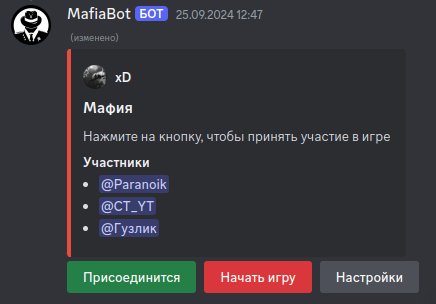
  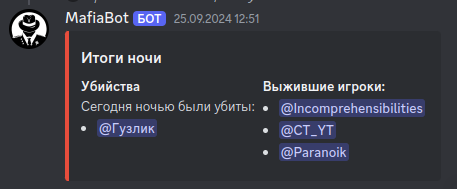 
  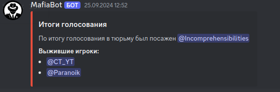
  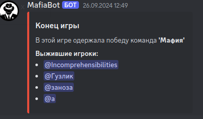
  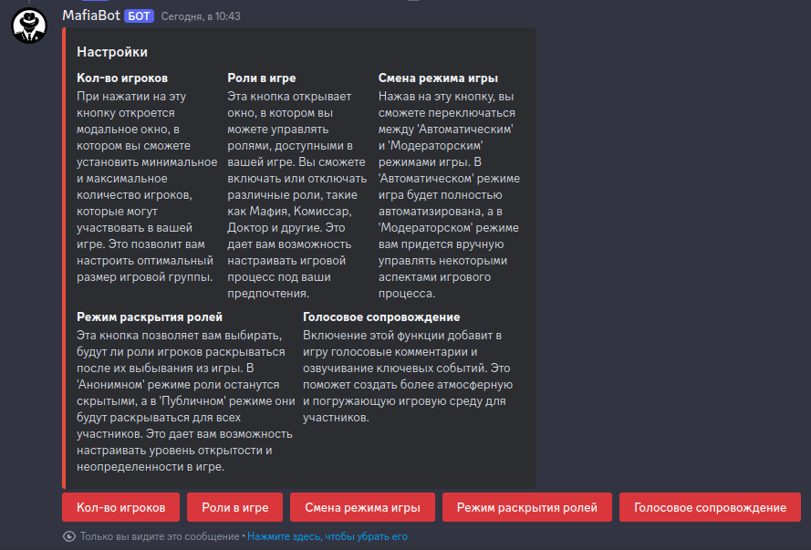
  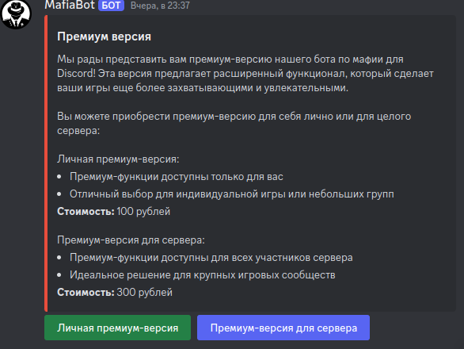
  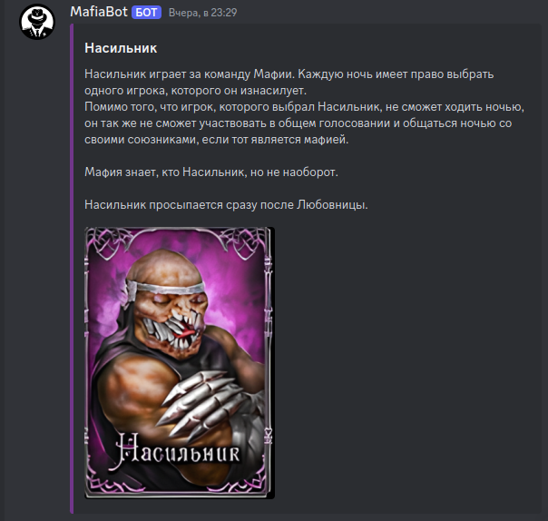
  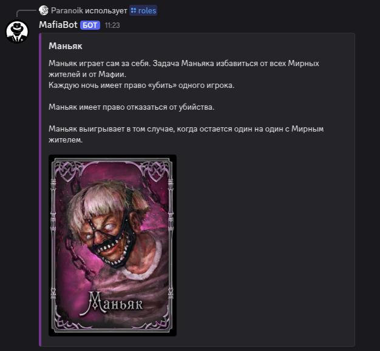
  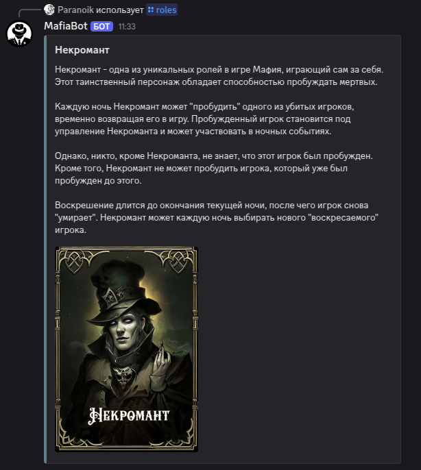
  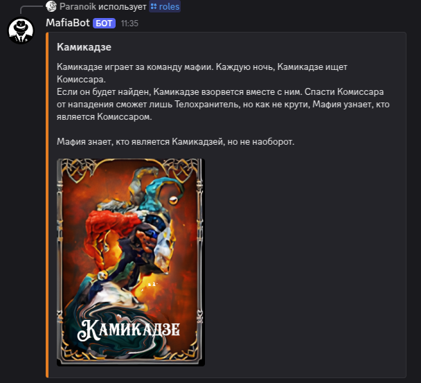


</div>

## 🤝 Участие в разработке

Мы приветствуем вклад в развитие проекта! 

1. Форкните репозиторий
2. Создайте ветку (`git checkout -b feature/AmazingFeature`)
3. Сделайте коммит (`git commit -m 'Add some AmazingFeature'`)
4. Запушьте изменения (`git push origin feature/AmazingFeature`)
5. Откройте Pull Request

## 📜 Лицензия

Этот проект распространяется под лицензией MIT. Подробнее см. в файле [LICENSE](LICENSE).

---

> Сделайте ваши Discord-вечеринки незабываемыми с Mafia Bot! 🎭✨

